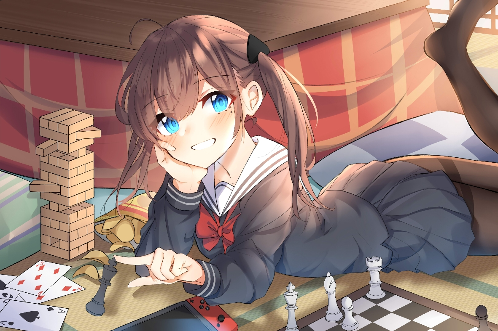

 
  
  # KaguraYayoi  神楽弥生
  ### 愿我们能在更开放的平行世界相遇
  #### Hope we can meet in a more open parallel world.
  

###### _MarkDown格式借鉴 [Jannchie见齐](https://github.com/Jannchie)_

<!--
**Fjaxzhy/Fjaxzhy** is a ✨ _special_ ✨ repository because its `README.md` (this file) appears on your GitHub profile.

Here are some ideas to get you started:

- 🔭 I’m currently working on ...
- 🌱 I’m currently learning ...
- 👯 I’m looking to collaborate on ...
- 🤔 I’m looking for help with ...
- 💬 Ask me about ...
- 📫 How to reach me: ...
- 😄 Pronouns: ...
- ⚡ Fun fact: ...
-->
